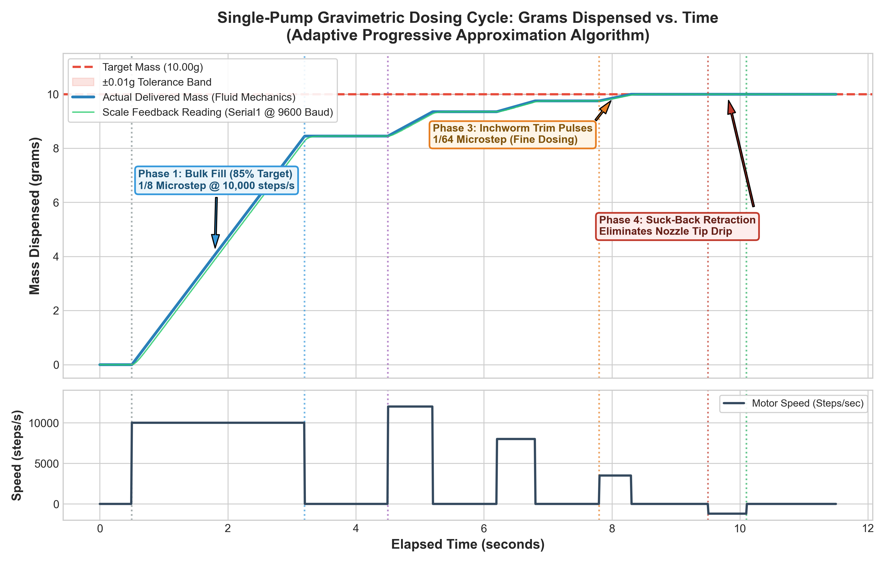
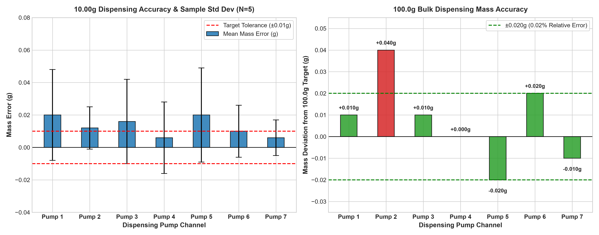
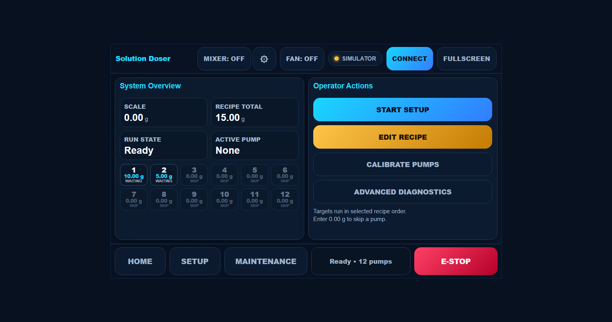
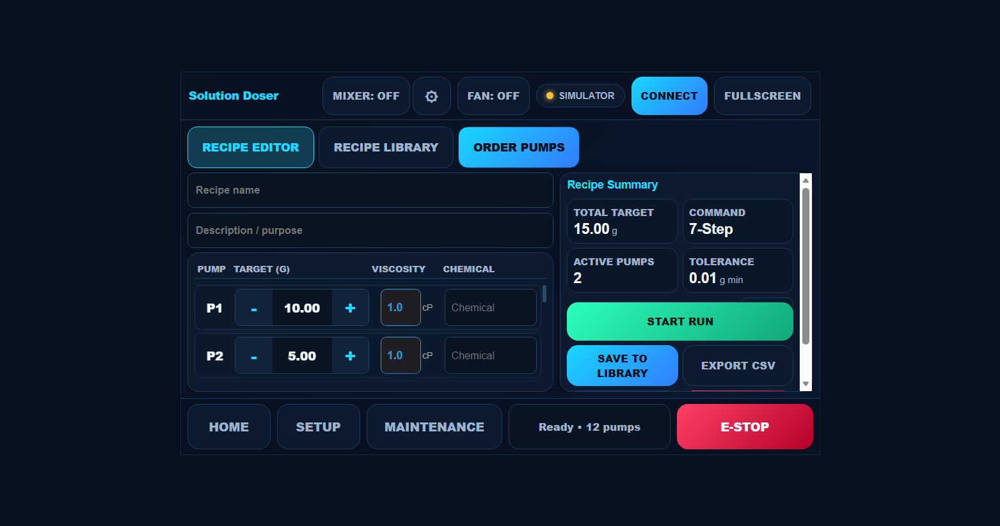
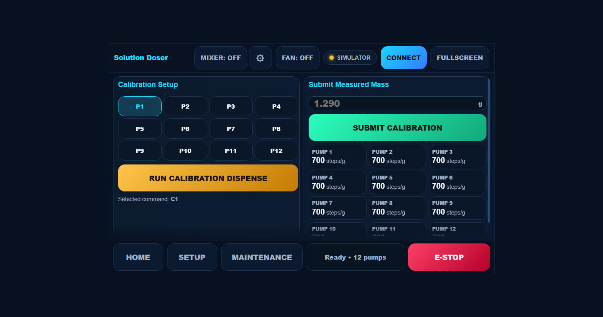

# Multi-Pump Gravimetric Automated Liquid Dispensing Robot

[](https://platformio.org/)
[](https://www.arduino.cc/)
[-orange.svg)]()
[]()

A high-precision, closed-loop gravimetric liquid dosing system designed for automated multi-component solution preparation. The system uses real-time digital scale feedback ($0.01\text{g}$ resolution) over serial to eliminate volumetric errors caused by fluid viscosity, temperature, thermal expansion, or tube degradation, achieving a strict **$\pm 0.01\text{g}$ absolute mass accuracy** ($\pm 10\text{ mg}$) across wide viscosity ranges ($1\text{ cP}$ water to $1,000\text{ cP}$ glycerol).

---

## 📋 Table of Contents

- [System Architecture \& Overview](#-system-architecture--overview)
- [Hardware \& Electrical Specifications](#-hardware--electrical-specifications)
- [Firmware Architecture \& Dosing Algorithm](#-firmware-architecture--dosing-algorithm)
  - [Adaptive Progressive Approximation](#adaptive-progressive-approximation)
  - [Dynamic Microstepping Switching](#dynamic-microstepping-switching)
  - [Inertia Compensation \& Suck-Back Retraction](#inertia-compensation--suck-back-retraction)
- [Droplet Mechanics \& Nozzle Optimization](#-droplet-mechanics--nozzle-optimization)
- [Empirical Accuracy \& Testing Benchmarks](#-empirical-accuracy--testing-benchmarks)
- [Web Dashboard \& User Interface](#-web-dashboard--user-interface)
- [Serial Communication Protocol \& CLI Reference](#-serial-communication-protocol--cli-reference)
- [Build, Upload, and Installation Guide](#-build-upload-and-installation-guide)
- [Project Directory Structure](#-project-directory-structure)

---

## 🔬 System Architecture & Overview

Traditional peristaltic pumps rely on volumetric calibration (steps per milliliter), which degrades significantly when fluid viscosity changes or tubing wears down over time. This system overcomes volumetric limitations through **closed-loop gravimetric feedback**:

```
 ┌────────────────┐     Target Doses     ┌────────────────────────┐
 ├────────────────┤  (Web UI / Serial)   │  Arduino Giga R1 WiFi  │
 │ Web Dashboard  ├─────────────────────►│  (STM32 H747 M7 Core)  │
 │ (index.html)   │◄─────────────────────┤                        │
 └────────────────┘  Telemetry / Status  └───┬────────────────┬───┘
                                             │                │
                                       TMC2209 Step/Dir   Serial1
                                             │             (9600 Baud)
                                             ▼                ▲
                                     ┌───────────────┐ ┌──────┴────────┐
                                     │ Peristaltic   │ │ Digital Scale │
                                     │ Motor Pumps   │ │ Balance       │
                                     └───────┬───────┘ └──────┬────────┘
                                             │                │
                                             ▼ Fluid Drops    │ Live Mass
                                     ┌────────────────────────┴┐
                                     │  Receiving Vessel       │
                                     └─────────────────────────┘
```

---

## 🔌 Hardware & Electrical Specifications

The system utilizes a **parallel wiring architecture** on an **Arduino Giga R1 WiFi** to control up to **16 peristaltic pump channels** (12 channels pre-configured out-of-the-box). Each pump has its own dedicated `STEP` pin, while `DIR`, `ENABLE` (active LOW), `MS1`, and `MS2` lines are shared across all drivers.

> [!IMPORTANT]
> The Arduino Giga operates at **3.3 V logic**. Ensure TMC2209 driver `VIO` logic power is connected to 3.3 V (not 5 V).

| Function | Pin (Arduino Giga R1) | Description |
| :--- | :---: | :--- |
| **Pump 1–8 STEP** | `53, 51, 49, 47, 45, 43, 41, 39` | Dedicated step lines for channels 1 to 8 |
| **Pump 9–12 STEP** | `37, 35, 33, 31` | Dedicated step lines for channels 9 to 12 |
| **Pump 13–16 STEP**| `-1` (Placeholder) | Expandable up to 16 channels |
| **Shared DIR** | `27` | Shared direction line for all drivers |
| **Shared ENABLE** | `29` | Shared enable line (**Active LOW**) |
| **Shared MS1** | `25` | Shared TMC2209 microstep config pin 1 |
| **Shared MS2** | `23` | Shared TMC2209 microstep config pin 2 |
| **Mixer STEP Pin** | `52` | Step pulse line for Mixer motor |
| **Mixer DIR Pin** | `48` | Direction line for Mixer motor |
| **Mixer ENABLE Pin**| `50` | Enable line for Mixer motor (**Active LOW**) |
| **Mixer Driver UART**| `Serial4` (TX4 on `14`, RX4 on `15`) | TMC2209 UART serial config (115200 Baud) |
| **DC Fan Relay** | `22` | Relay control line for cooling fan |
| **Digital Scale** | `Serial1` (RX1/TX1) | 9600 Baud ASCII mass reading |
| **Host PC Interface**| `Serial` (USB CDC) | 9600 Baud CLI & Web Serial interface |

---

## 🧠 Firmware Architecture & Dosing Algorithm

### Adaptive Progressive Approximation

Each pump channel executes a multi-stage closed-loop state machine:

```
  [SEQ_PROMPT_TARGET] ──► [DISPENSE_BULK_FILL] ──► [DISPENSE_SETTLE_BULK]
                                                             │
  [DISPENSE_SUCK_BACK] ◄── [DISPENSE_SETTLE_TRIM] ◄── [DISPENSE_TRIM_PULSE]
          │
          ▼
  [DISPENSE_COMPLETE] ──► (Next Pump or Done)
```

1. **Bulk Fill Phase**: Dispenses 85% of target mass at **1/8 microstepping** ($10,000\text{ steps/sec}$) to minimize dispense duration.
2. **Bulk Settle Phase**: Stops motor and monitors scale noise until stability criteria (`isScaleSettled`) are satisfied.
3. **Trim Micro-Pulse Phase**: Switches hardware microstepping to **1/64 microstepping** ($12,000\text{ steps/sec}$) and computes proportional micro-pulses to close remaining residual error without overshooting.
4. **Inchworm Burst Mode**: For final residual mass under $0.045\text{g}$ ($2 \times m_{\text{drop}}$), commands single-step bursts ($64\text{ microsteps}$) to build fluid on nozzle tip until gravitational detachment.
5. **Suck-Back Retraction**: Reverses motor at cycle end by fixed microsteps ($3,200\text{ uSteps}$ for water, $9,600\text{ uSteps}$ for glycerol) to draw fluid back into nozzle tip, eliminating stringing and hanging droplets.



### Dynamic Microstepping Switching

The firmware dynamically reconfigures TMC2209 `MS1` and `MS2` pins on the fly:

| Resolution | MS1 Pin | MS2 Pin | Operating Mode |
| :---: | :---: | :---: | :--- |
| **1/8 Microstep** | `LOW` | `LOW` | High-speed Volumetric Bulk Filling \& Step Calibration (`C1`–`C16`) |
| **1/16 Microstep**| `HIGH` | `LOW` | High-Viscosity Glycerol Operations \& Prime/Flush Cycles |
| **1/64 Microstep**| `LOW` | `HIGH` | High-Precision Trim Micro-Pulsing, Inchworm Bursts, \& Retraction |

### Inertia Compensation & Suck-Back Retraction

- **Viscosity Stop-Lead**: Dynamically interpolates in-flight liquid mass compensation using $\log_{10}(\text{viscosity})$ scaling ($0.01\text{g}$ for water at $1\text{ cP}$; $0.10\text{g}$ for glycerol at $1,000\text{ cP}$).
- **Mirror Mounting Flip (`pumpDirSign`)**: Alternating odd/even channels ($1, 3, 5 \dots = +1$; $2, 4, 6 \dots = -1$) to compensate for physical mirror-mounting of motor heads.

---

## 💧 Droplet Mechanics & Fluid Capacitance

### 1. Droplet Detachment (Tate's Law)
Nozzle geometry dictates minimum droplet detachment mass according to **Tate's Law**:

$$m_{\text{drop}} = \frac{2\pi r \gamma}{g}$$

where $r$ is nozzle outer radius, $\gamma$ is surface tension ($0.0728\text{ N/m}$ for water), and $g = 9.81\text{ m/s}^2$.

| Nozzle Geometry | Outer Radius $r$ | Theoretical Drop Mass | Empirical Drop Mass | $\pm 0.01\text{g}$ Spec Compliance |
| :--- | :---: | :---: | :---: | :---: |
| **Bare Tubing ($3\text{mm ID}/6\text{mm OD}$)** | $1.50\text{ mm}$ | $0.070\text{ g}$ | $0.050\text{g} - 0.070\text{g}$ | **FAIL** (1 drop exceeds tolerance) |
| **18-Gauge Needle** | $0.635\text{ mm}$ | $0.030\text{ g}$ | $0.020\text{g} - 0.025\text{g}$ | PASS (**+400% fluidic resistance**) |
| **16-Gauge Needle (Selected)** | **$0.825\text{ mm}$** | **$0.038\text{ g}$** | **$0.0225\text{ g}$** | **OPTIMAL** (Balances flow \& precision) |

Sizing down to an 18G needle causes a **~400% surge in fluidic resistance** per **Poiseuille’s Law** ($R_{\text{fluid}} \propto \frac{1}{r_{\text{in}}^4}$), risking motor stalls during viscous glycerol dosing. Therefore, **16-Gauge blunt stainless steel dispensing needles** were selected.

### 2. Fluid Capacitance & Elastic Tubing Compliance ($\text{C}_{\text{fluid}}$)
The elasticity of the flexible silicone tubing stores energy under pressure, acting as a fluidic capacitor:

$$C = \frac{\Delta V}{\Delta P} = \frac{\pi D^3 L}{4 E h}$$

where:
- $C$: Volumetric fluid capacitance (compliance), representing volume change per pressure change ($\text{m}^3/\text{Pa}$)
- $\Delta V$: Excess volume stored due to tube wall ballooning ($\text{m}^3$)
- $\Delta P$: Internal fluid backpressure ($\text{Pa}$), governed by Poiseuille’s Law ($R_{\text{fluid}} \propto \frac{\mu L}{D^4}$)
- $D$: Inner diameter of unpressurized tubing ($\text{m}$)
- $L$: Length of elastic tubing section ($\text{m}$)
- $E$: Young’s Modulus of the tubing material ($\text{Pa}$; lower $E$ = softer, more elastic silicone)
- $h$: Tubing wall thickness ($\text{m}$)

**Physical Impact & Control Mitigation**:
1. **Post-Stop Residual Drip**: High backpressure ($\Delta P$) during bulk fill stretches the elastic walls ($E$), storing an excess fluid volume $\Delta V = C \cdot \Delta P$. When the motor stops, the tube wall relaxes, forcing $\Delta V$ out of the nozzle tip as a post-dispense drip.
2. **Active Retraction Mitigation (`DISPENSE_SUCK_BACK`)**: To counter line expansion, the firmware executes a dedicated reverse step sequence ($3,200\text{ uSteps}$ for water, $9,600\text{ uSteps}$ for glycerol) at cycle completion, generating negative pressure ($\Delta P_{\text{retract}} < 0$) to collapse tube expansion and lock liquid inside the tip.

---

## 📊 Empirical Accuracy & Testing Benchmarks

The system's gravimetric dosing accuracy was characterized across active channels using automated Python benchmark scripts (`accuracy_test.py`). 



### Benchmark Summary Data ($10.00\text{g}$ Target Mass)

| Pump Channel | Samples ($N$) | Target Mass | Mean Actual | Mean Error | Std Dev ($\sigma$) | Max \|Error\| | Limit of Error | Accuracy at Target |
| :---: | :---: | :---: | :---: | :---: | :---: | :---: | :---: | :---: |
| **Pump 1** | 5 | $10.00\text{ g}$ | $10.020\text{ g}$ | $+0.020\text{ g}$ | $0.028\text{ g}$ | $0.050\text{ g}$ | $0.077\text{ g}$ | $99.23\%$ |
| **Pump 2** | 5 | $10.00\text{ g}$ | $10.012\text{ g}$ | $+0.012\text{ g}$ | $0.013\text{ g}$ | $0.030\text{ g}$ | $0.038\text{ g}$ | $99.62\%$ |
| **Pump 3** | 5 | $10.00\text{ g}$ | $10.016\text{ g}$ | $+0.016\text{ g}$ | $0.026\text{ g}$ | $0.050\text{ g}$ | $0.068\text{ g}$ | $99.32\%$ |
| **Pump 4** | 5 | $10.00\text{ g}$ | $10.006\text{ g}$ | $+0.006\text{ g}$ | $0.022\text{ g}$ | $0.030\text{ g}$ | $0.050\text{ g}$ | $99.50\%$ |
| **Pump 5** | 5 | $10.00\text{ g}$ | $10.020\text{ g}$ | $+0.020\text{ g}$ | $0.029\text{ g}$ | $0.060\text{ g}$ | $0.078\text{ g}$ | $99.22\%$ |
| **Pump 6** | 5 | $10.00\text{ g}$ | $10.010\text{ g}$ | $+0.010\text{ g}$ | $0.016\text{ g}$ | $0.030\text{ g}$ | $0.042\text{ g}$ | $99.58\%$ |
| **Pump 7** | 5 | $10.00\text{ g}$ | $10.006\text{ g}$ | $+0.006\text{ g}$ | $0.011\text{ g}$ | $0.020\text{ g}$ | $0.029\text{ g}$ | **$99.71\%$** |

---

## 🖥️ Web Dashboard & User Interface

The system includes a single-file Web Dashboard located at [`dashboard/index.html`](file:///C:/Users/littl/Documents/PlatformIO/Projects/Automated%20Solutions%20Robot%20Project/dashboard/index.html).

### 1. System Overview & Dosing Monitor Screen


### 2. Recipe Management & CSV Library


### 3. Pump Calibration & Diagnostics Interface


### Dashboard Highlights:
- **Web Serial API**: Directly communicates with the microcontroller over USB at 9600 Baud in Chrome/Edge without backend servers.
- **Telemetry Processing**: Parses `TELEMETRY:mass,state` at 10 Hz to drive live scale dials, progress bars, and pump status badges.
- **CSV Recipe Management**: Full support for importing, editing, saving to `localStorage` (`grav_recipes_v1`), dragging-and-dropping, and exporting CSV recipe files.
- **Offline Simulator Mode**: Integrated simulation engine for testing UI features without hardware attached.

---

## 📡 Serial Communication Protocol & CLI Reference

Both Web Dashboard and terminal monitors (9600 Baud, Newline `\n`) communicate using standard ASCII strings:

| Command | Arguments | Description | Example |
| :--- | :--- | :--- | :--- |
| **`GET INFO`** | None | Returns active channels (`INFO:PUMPS=12`) and viscosity profile settings. | `GET INFO` |
| **`TARGET`** | `<pump> <weight_g>` | Sets target dispense mass for a specific channel. | `TARGET 1 12.50` |
| **`PRIME`** | `<mask?> [sec] [speed]`| Primes selected pumps in forward direction.<br>• `mask` = channel bitmask. | `PRIME 7 10` |
| **`FLUSH`** | `<mask?> [sec]` | Flushes selected pumps in **reverse** back into supply bottles. | `FLUSH 7 15` |
| **`T`** | None | **Software Tare**: Zeroes out net scale weight (`currentWeight = 0.00g`). | `T` |
| **`STATUS`** | None | Prints full channel configuration table and calibration constants. | `STATUS` |
| **`S`** | None | **Emergency Stop**: Immediately halts all active stepper motors. | `S` |
| **`C1`–`C16`**| None | Runs calibration step dispense (6,250 full steps) on target pump. | `C1` |
| **`H1`–`H16`**| None | Sets channel to **High Viscosity** profile (Glycerol). | `H1` |
| **`L1`–`L16`**| None | Sets channel to **Low Viscosity** profile (Water). | `L1` |

---

## 🛠️ Build, Upload, and Installation Guide

### Prerequisites
- [PlatformIO IDE](https://platformio.org/) or PlatformIO CLI installed.
- USB connection to Arduino Giga R1 WiFi.

### Building & Flashing for Arduino Giga R1 WiFi
The root `platformio.ini` targets the Arduino Giga R1 WiFi M7 core:

```ini
[env:giga_r1_m7]
platform = ststm32
board = giga_r1_m7
framework = arduino
lib_extra_dirs = ~/Documents/Arduino/libraries
lib_deps = 
	waspinator/AccelStepper @ ^1.64
	teemuatlut/TMCStepper @ ^0.7.3
```

To compile and flash:
```bash
# Build firmware
platformio run -e giga_r1_m7

# Upload to connected Arduino Giga R1
platformio run -e giga_r1_m7 -t upload
```

---

## 📂 Project Directory Structure

```text
Automated Solutions Robot Project/
├── dashboard/
│   └── index.html               # Web Serial dashboard & recipe manager
├── include/
│   └── README                   # Header includes
├── lib/
│   └── README                   # Private libraries
├── src/
│   ├── main.cpp                 # Arduino setup and loop entry point
│   ├── config.h                 # Dispense parameters, timing, & pinout config
│   ├── Multipump_dispensing.h   # Multi-pump state machine headers
│   ├── Multipump_dispensing.cpp # 16-channel Giga firmware implementation
│   ├── Mixer.h / Mixer.cpp      # PWM mixer motor driver module
│   └── calibration_store.h/.cpp # EEPROM / Flash calibration storage
├── scratch/
│   └── dispenser_simulation.py  # Python simulation model
├── DROP_CHARACTERISTICS_DATA.md # Tate's Law & droplet mechanics documentation
├── CSV-Recipe-Plan.md           # Dashboard CSV recipe specification
├── accuracy_test.py             # Automated serial accuracy benchmark script
├── drop_characterize.py         # Automated drop characterization analyzer
├── dispensing_accuracy_plots.png# Empirical accuracy visualizer plot
├── accuracy_plot.png            # Characterization plot
├── platformio.ini               # PlatformIO build configuration
└── README.md                    # System documentation
```

---

## 📜 License & Citation

Developed for the **Automated Solutions Robot Project** capstone research project. Feel free to use and extend this codebase for gravimetric liquid dosing, automated chemistry, and robotics applications!
